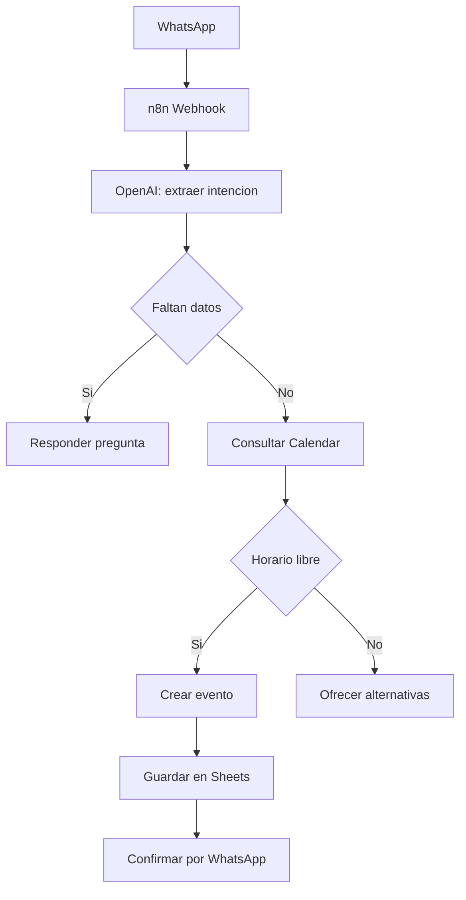

# Caso practico n8n: agente de turnos

## Objetivo de este modulo

Disenar un agente educativo para turnos con WhatsApp, n8n, Google Calendar, Google Sheets e IA sin conectar cuentas reales.

## Explicacion simple

El agente recibe un mensaje, entiende intencion, pide datos faltantes, consulta disponibilidad, registra reserva y responde. Al inicio todo debe probarse con datos simulados.

## Analogia cotidiana

Es una recepcionista digital con una agenda y una planilla.

## Flujo Mermaid



## Tabla de nodos n8n

| Paso | Nodo n8n | Funcion |
| --- | --- | --- |
| 1 | Webhook | Recibe mensaje |
| 2 | OpenAI | Extrae intencion y datos |
| 3 | IF | Decide si faltan datos |
| 4 | Google Calendar | Consulta disponibilidad |
| 5 | Google Calendar | Crea evento |
| 6 | Google Sheets | Guarda registro |
| 7 | WhatsApp proveedor | Responde al cliente |

## Estructura de Google Sheets

```txt
fecha_registro | nombre | whatsapp | servicio | fecha_turno | hora_turno | estado | observaciones
```

## Prompt del nodo IA

```txt
Actua como asistente de turnos para una clinica en Paraguay.

Extrae del mensaje:
- intencion
- nombre
- telefono
- servicio
- fecha deseada
- hora deseada
- datos faltantes

Reglas:
- No inventes horarios.
- Si falta informacion, pregunta amablemente.
- No confirmes hasta que Calendar confirme disponibilidad.
- Responde en espanol claro.

Devuelve JSON valido.
```

## JSON esperado

```json
{
  "intent": "agendar",
  "name": "",
  "phone": "",
  "service": "limpieza dental",
  "desired_date": "viernes",
  "desired_time": "tarde",
  "missing_fields": ["name"],
  "reply_to_customer": "Perfecto, te ayudo a agendar. ¿Me pasas tu nombre?"
}
```

## Como Codex ayuda en este flujo

Codex puede disenar el workflow, escribir prompts, crear documentacion, revisar errores, generar datos de prueba, crear checklist de QA y ayudar a escalar luego a backend propio.

## Buenas practicas

Probar con WhatsApp simulado. No crear eventos reales hasta validar. Registrar errores en una hoja separada.

## Errores comunes

Confirmar sin consultar Calendar. Inventar horarios. No manejar cancelaciones.

## Prompt recomendado

```txt
Disena un workflow n8n educativo para turnos. No conectes cuentas reales. Usa datos simulados y dame nodos, prompts, estructura Sheets y checklist QA.
```

## Mini ejercicio

Adapta el flujo a barberia, estetica o taller mecanico.

## Checklist de comprension

- Entiendo el flujo.
- Se que no se confirma sin disponibilidad.
- Se probar sin cuentas reales.

